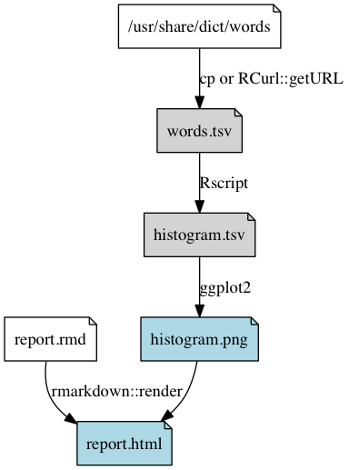

Automating Data-analysis Pipelines
================================================================================

The goal of this activity is to create a pipeline that will

+ calculate a histogram of English word lengths
+ determine the most common word length
+ generate a figure of this histogram
+ render a RMarkdown report in HTML and PDF

You will automate this pipeline using `make`!

Dependency graph of the pipeline
================================================================================

[](images/activity.gv)

Use RStudio to run `make`
================================================================================

***Important*** First select *Tools -> Global Options -> Code Editing* and make sure that *Insert spaces for tabs* is *not* checked. Make requires that lines be indented with tabs and not spaces.

+ Create an RStudio project: *File -> New Project*
+ Create a new text file: *File -> New File -> Text File*
+ Save it, and name it `Makefile`
+ Start editing your first `Makefile`!
	```makefile
	all:
		echo Build all
	
	clean:
		echo Clean all
	```
+ Select *Build -> Build All*
+ The result will appear under the *Build* tab, usually found in the top-right corner of RStudio

### *Build* menu items

+ *Build All* runs `make all`
+ *Clean and Rebuild* runs `make clean all`
+ *Clean All* runs `make clean`

For these menu items to work your `Makefile` needs to have phony targets named `all` and `clean`.

Run `make` from the command line
================================================================================

+ Open a terminal
+ Change your working directory to that of your `Makefile`

	```sh
	cd your-project
	```

+ Run

	```sh
	make all
	make clean all
	make clean
	```
