# cm007 Notes and Exercises: ggplot2, Round 2
2017-09-26  


```r
suppressPackageStartupMessages(library(tidyverse))  # The tidyverse contains ggplot2!
suppressPackageStartupMessages(library(gapminder))
knitr::opts_chunk$set(fig.width=4, fig.height=3)
```

## Continuation of Scatterplots

### Regression curve

- Crash course on regression
    - Regression analysis fits some curve through the data, representing the mean of Y given the specified X value.
    - Sometimes we assume it's a line, and take this "mean curve" to be the line of best fit.
    - Sometimes we fit a generic curve by averaging "nearby" points. 

To add a regression line/curve, add a layer `geom_smooth` to your plot. Probably two of the most useful arguments to `geom_smooth` are:

- `method=`...
    - ...`"lm"` for a straight line. Stands for "Linear Model".
    - ...other for a generic curve (called a smoother; default, hence the "smooth" part of `geom_smooth`).
- `se=`... controls whether or not a confidence interval is plotted.

Examples:


```r
vc1 <- ggplot(gapminder, aes(year, lifeExp)) +
    geom_point() 
vc1 + geom_smooth(se=FALSE)
```

```
## `geom_smooth()` using method = 'gam'
```

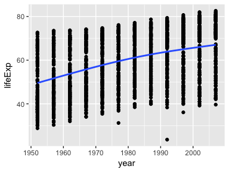<!-- -->

```r
vc1 + geom_smooth(method="lm")
```

<!-- -->


__Exercise 1__: Make a plot of `year` (x) vs `lifeExp` (y), with points coloured by continent. Then, to that same plot, fit a straight regression line to each continent, without the error bars. If you can, try piping the data frame into the `ggplot` function.


```r
ggplot(gapminder, aes(year, lifeExp,
                      colour=continent)) +
    geom_point() +
    geom_smooth(method="lm", se=FALSE)
```

<!-- -->


__Exercise 2__: Repeat Exercise 1, but switch the _regression line_ and _geom\_point_ layers. How is this plot different from that of Exercise 1?


```r
ggplot(gapminder, aes(year, lifeExp,
                      colour=continent)) +
    geom_smooth(method="lm", se=FALSE) +
    geom_point()
```

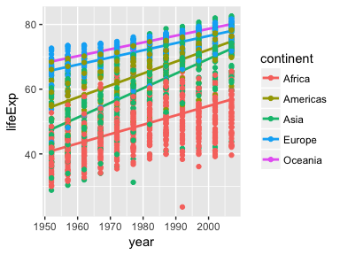<!-- -->


__Exercise 3__: Omit the `geom_point` layer from either of the above two plots (it doesn't matter which). Does the line still show up, even though the data aren't shown? Why or why not?


```r
ggplot(gapminder, aes(year, lifeExp,
                      colour=continent)) +
    geom_smooth(method="lm", se=FALSE)
```

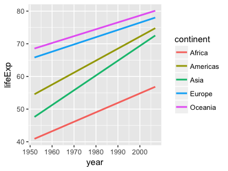<!-- -->


### Facetting

We saw that we can __group__ by using scales. For example, we can distinguish continents by using different shape or colour:


```r
ggplot(gapminder, aes(gdpPercap, lifeExp)) +
    geom_point(aes(colour=continent))
```

<!-- -->

```r
ggplot(gapminder, aes(gdpPercap, lifeExp)) +
    geom_point(aes(shape=continent))
```

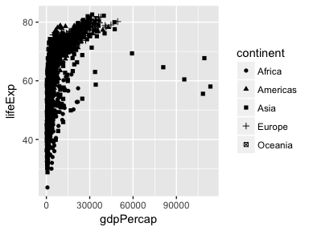<!-- -->

But these plots can get overloaded. In comes __facetting__ to save the day! Let's add this to our list of concepts:

- :white_check_mark: __geometric objects__, or `geom_`s. 
- :white_check_mark: __scales__, linked by...
- :white_check_mark: __aesthetics__, through the `aes` function.
- \*NEW* __facetting__.

Facetting separates data from each group into its own "mini plot", called a _panel_. These panels are arranged next to each otherfor easier comparison. There are two facetting functions in `ggplot2`:

- `facet_wrap`: 1D facetting -- we'll focus on this first.
- `facet_grid`: 2D facetting

`facet_wrap` puts the panels in "reading order", and goes to a new line if there's not enough room. Mandatory argument specification is `facet_wrap(~ VARIABLE)`. Example:


```r
ggplot(gapminder, aes(gdpPercap, lifeExp)) +
    facet_wrap(~ continent) +
    geom_point()
```

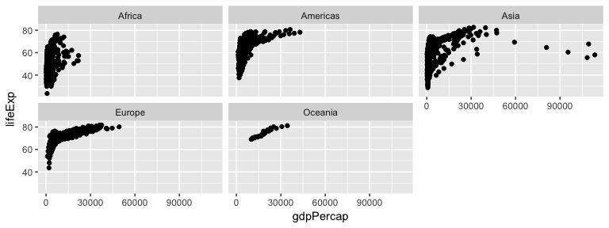<!-- -->

As for other arguments of `facet_wrap` that I find to be most useful, check the documentation for `scales` and `ncol` -- and if you're brave, `labeller`. 

__Exercise 4__: Make a plot of `year` (x) vs `lifeExp` (y), facetted by continent. Then, fit a smoother through the data for each continent, without the error bars. Choose a span that you feel is appropriate.


```r
ggplot(gapminder, aes(year, lifeExp)) +
    facet_wrap(~ continent) +
    geom_point() +
    geom_smooth(se=FALSE, span=1, method="loess")
```

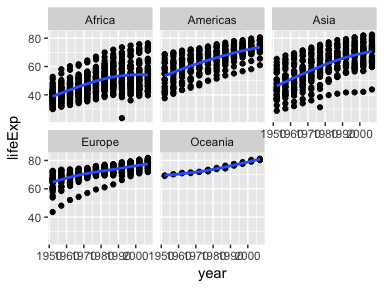<!-- -->

A small span results in a more jagged curve; a larger one results in a smoother curve. Here's a better example of using the `span` argument -- first too small, then too big, then "just right". The idea is to "play" with this parameter to get it just right. NOTE: `span` only works with `method="loess"`!


```r
vc3 <- ggplot(gapminder, aes(gdpPercap, lifeExp)) +
    facet_wrap(~ continent) +
    geom_point() +
    scale_x_log10()
vc3 + geom_smooth(method="loess", span=0.2) # Span too small
```

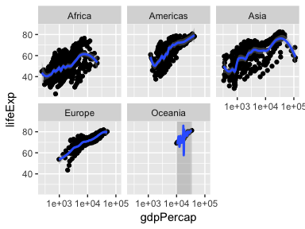<!-- -->

```r
vc3 + geom_smooth(method="loess", span=10) # Span too big
```

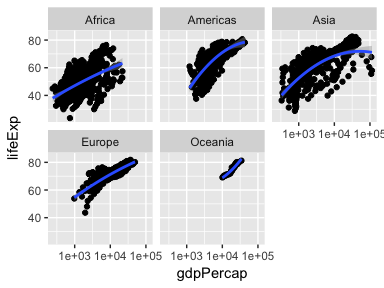<!-- -->

```r
vc3 + geom_smooth(method="loess", span=0.9) # Span just right
```

<!-- -->


`facet_grid` puts the panels in a grid. Each row corresponds to one grouping, and each column corresponds to another grouping. Mandatory argument specification: `facet_grid(GROUPING_VARIABLE_1 ~ GROUPING_VARIABLE_2)`.

Example: Let's also facet by "small" (<=7,000,000 population) and "large" (>7,000,000 population) countries. We'll need to add a "size" variable; we'll do that with `dplyr`, and pipe the result into the `ggplot` function:


```r
vc2 <- gapminder %>% 
    mutate(size=c("small", "large")[(pop>7000000) + 1]) %>% 
    ggplot(aes(gdpPercap, lifeExp)) +
    facet_grid(size ~ continent) 
vc2 + geom_point()
```

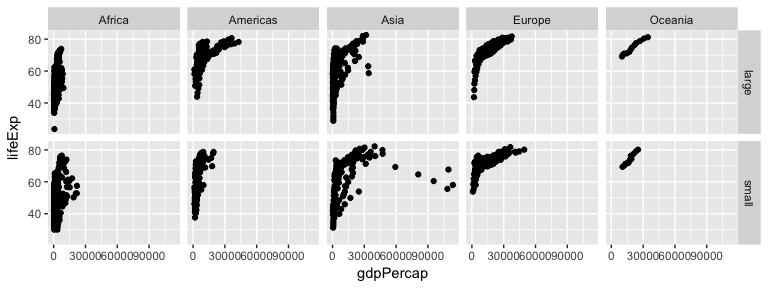<!-- -->

Everything we've learned prior to this works in conjunction with facetting:

- Colours:


```r
vc2 + geom_point(aes(colour=year))
```

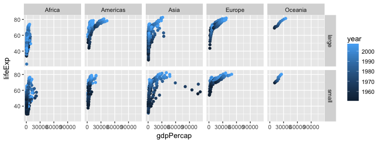<!-- -->

- Regression curves and log scales:


```r
vc2 + 
    geom_point(colour="brown",
               alpha=0.2) +
    geom_smooth() +
    scale_x_log10()
```

```
## `geom_smooth()` using method = 'loess'
```

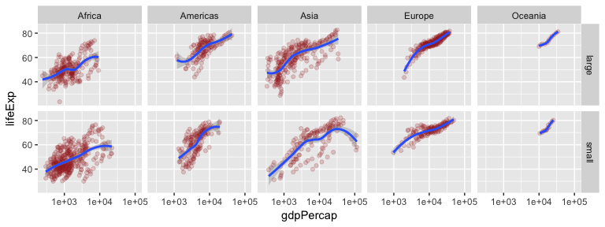<!-- -->


### Connect the dots with `geom_line` 

Sometimes it makes sense to "connect the dots" in a scatterplot, especially if time is involved. The two functions to help us do this are:

- `geom_line`: connect the dots from left-to-right.
- `geom_path`: connect the dots in the order that they appear in the data frame. 

With these `geom`s, it's so important to remember to specify `group=VARIABLE` in your aesthetics (`aes` function), otherwise ggplot won't distinguish between groups.

Example: life expectancy over time for each country.


```r
## Without the `group` specification:
ggplot(gapminder, aes(year, lifeExp)) +
    geom_line()
```

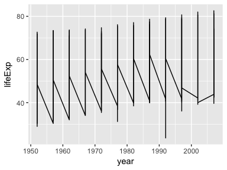<!-- -->

```r
## With the group specification:
ggplot(gapminder, aes(year, lifeExp, group=country)) +
    geom_line(alpha=0.2)
```

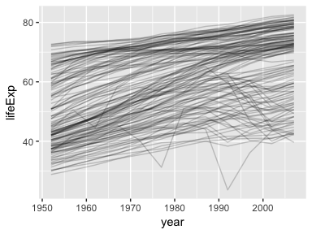<!-- -->

PS: such "spaghetti plots" _are_ actually useful -- they give us a sense of the _distribution_ of trends. 

`geom_path` is typically used when a "time" variable is not shown on an axis. For example, let's look at a scatterplot of `pop` vs. `gdpPercap` of Afghanistan, and let's "connect the dots" in the order of time.


```r
gapminder %>%
    filter(country=="Afghanistan") %>% 
    arrange(year) %>% 
    ggplot(aes(pop, gdpPercap)) +
    geom_point() +
    geom_path()
```

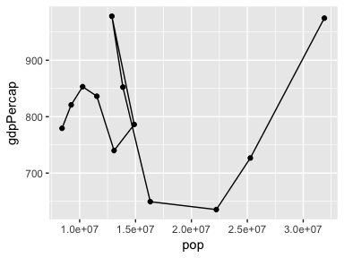<!-- -->

We can see the _path_ that the population and GDP per capita took for Afghanistan. 

__Exercise 5__: Plot the population over time (year) using lines, so that each country has its own line. Colour by `gdpPercap`. Add alpha transparency to your liking. 


```r
ggplot(gapminder, aes(year, pop, group=country, colour=gdpPercap)) +
    geom_line(alpha=0.2) 
```

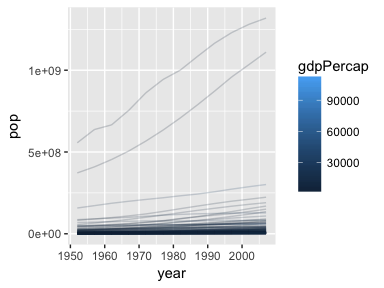<!-- -->

__Exercise 6__: Add points to the plot in Exercise 5.


```r
ggplot(gapminder, aes(year, pop, group=country)) +
    geom_line(aes(colour=gdpPercap), alpha=0.2) +
    geom_point() +
    scale_y_log10()
```

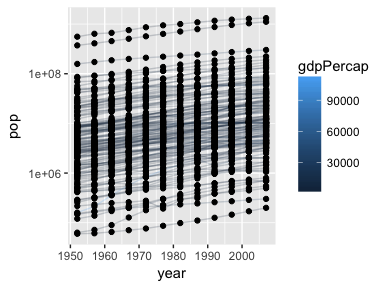<!-- -->


