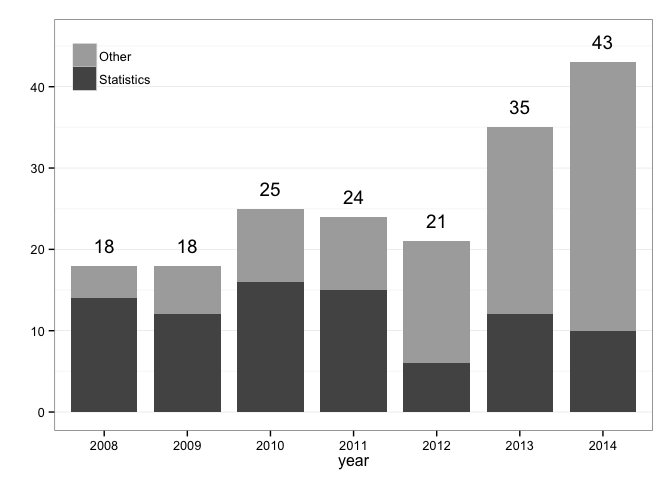

# STAT 545 enrollment over time
Jenny Bryan  
21 October, 2014  

STAT 545 Exploratory Data Analysis can be offered from 1 to 3 credits. From 2008 to 2013, I know we have offered it as a 1.5 credit course from start of class in September until mid-October with 3 contact hours per week. In 2014 we are piloting an expansion to a 3 credit course, structured as the usual 1.5 credit STAT545A followed by 1.5 credits of a topics course STAT547M, occupying the same time slot and classroom.

I (Jenny Bryan) have taught STAT 545 every year since 2008, at least.

Here is some information on enrollment -- numbers and students' degree programs.

From 2008 to September 2014, cumulative enrollment is 184. This counts a small handful of unofficial auditors, typically post-docs and staff.

Enrollment has been growing over time. Enrollment in 2014 is more than twice that of 2008.

 

It is a very diverse group of students, with STAT being the most frequent specialization yet accounting for less than half of cumulative enrollments.

We've had students from at least 48 different specializations, with 19 represented by at least two students (see barchart above). Here are the remaining specializations, from which we've had exactly one student each:

-------------------------------------------------  ---------------------------
actuarial science                                  Lib, Arch and Info Stud    
biochemistry                                       Management Info Systems    
Biochemistry & Molecular Biol                      Mathematics And Statistics 
Biomedical Physiology and Kinesiology              Medical Genetics           
Chemical Engineering                               Neuroscience               
Chemistry                                          Occupational Hygiene       
Civil Engineering                                  Oceanography               
Computer Science And Microbiology and Immunology   Pharmaceutical Science     
Education                                          Physics                    
Environmental Science                              Political Science          
Epidemiology                                       Resource Mgmt/Envirn Stud  
Health Services Management                         Sociology                  
Int Stds In Land & Food Syst                       Transportation & Logistics 
Kinesiology                                        Zoology                    
-------------------------------------------------  ---------------------------
