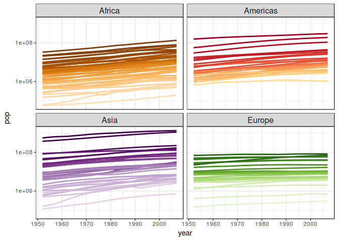

# Data from the Web - Homework
Andrew MacDonald  

## Big picture

We learned three ways of collecting data from the internet:

  * Accessing data using [rOpenSci](https://ropensci.org) packages that wrap APIs
  * Running (basic) API queries "by hand"
  * Web scraping

For the homework, we want you to either

  * combine two existing datasets in a novel (and reproducible!) way; at least one must come from the web
  * create a new dataset by web scraping
  
## General advice

Your procedure for obtaining and remixing data should be reproducible and, ideally, portable to your peer's system (avoid `setwd()`!).

For example, if your process involves obtaining some records (countries, species) at random, provide either the list of things chosen (id numbers, country codes etc.) OR use `set.seed()` so that your peer can produce the same random sample. 

Remember to protect your API key!

Be aware of rate limits on APIs when making repeated requests.

You can use several scripts/files to obtain your data. If you download lots of data, consider creating a pipeline with `make` or a `make`-like R script, so that you download the data only once!

Write and render an R Markdown document with a narrative of what you've done and why and the code that does it. What was most difficult? What are you most excited about in your future of getting data from the web?

## Please just tell me what to do! 

### Combine [`gapminder`](https://github.com/jennybc/gapminder) and data from [`geonames`](http://www.geonames.org/)

Install the `geonames` package (on [CRAN](https://cran.r-project.org/web/packages/geonames/index.html), on [GitHub](https://github.com/ropensci/geonames)). Make a user account (see the lecture notes) and use `geonames` to access data about the world's countries. Use data from `geonames` and `gapminder` to investigate either of these questions:

  * What is the relationship between per-capita GDP and the proportion of the population which lives in urban centers?
  * Consider the following graph of population against time (a modification of Jenny's [gapminder demo](https://github.com/jennybc/gapminder)):
    

```r
library("ggplot2")
library("gapminder")

ggplot(subset(gapminder, continent != "Oceania"),
       aes(x = year, y = pop, group = country, color = country)) +
  geom_line(lwd = 1, show_guide = FALSE) + facet_wrap(~ continent) +
  scale_color_manual(values = country_colors) + theme_bw() +
  theme(strip.text = element_text(size = rel(1.1))) + scale_y_log10()
```

```
## Warning: `show_guide` has been deprecated. Please use `show.legend`
## instead.
```

\ 

Replace population with *population density*. To do this, look up the country codes in `geonames()`, obtain the area of each country and compute density as population divided by area.

**TIP** check out the handy package [countrycode](https://github.com/vincentarelbundock/countrycode) to help you merge country names!

## .. But I'm tired of GDP 

We took quick looks at two other rOpenSci packages: [`rebird`](https://github.com/ropensci/rebird) and [`rplos`](https://github.com/ropensci/rplos). Both packages are on CRAN and more info is on their GitHub repo READMEs. Find out what data are available from each, and combine them! Here are three suggestions:

  * `rplos` and `rebird` -- how many articles are published on a bird species? 
  * `rplos` and `geonames` -- Choose a subset of countries. How many papers have been published by people from that country? In that country? How does that relate to GDP?
  * `rebird` and `geonames` -- Do countries with more bird species also have more languages?
  
For each of these tasks, produce an R Markdown report that illustrates how you obtained the data, how you processed it and successfully merged the two datasets. If you are downloading lots of data (or if you are worried about over-using an API) consider automating the process using `make`. 

## I want to aim higher!

* Look through the ropenSci [packages list](http://ropensci.org/packages/) and/or the [CRAN Task View on Web Technologies and Services](https://cran.r-project.org/web/views/WebTechnologies.html), find some existing resources, and remix those instead.

## even HIGHER

* Consult [Programmable Web](http://www.programmableweb.com/) and the [CRAN Task View on Web Technologies and Services](https://cran.r-project.org/web/views/WebTechnologies.html), discover an API which is NOT wrapped for R (yet!) and write a function (or package!) to query it.

## I am a leaf on the wind. See how I SOAR

  * Find an interesting website which is (a) __not__ already wrapped for R and (b) __does not__ have a published API. Scrape it into a clean, documented dataset. Look at the [process of cleaning gapminder](https://github.com/jennybc/gapminder/tree/master/data-raw) or your own candy survey cleaning for inspiration/comfort.
  
For example, in the class notes we scraped a dataset of research publications per country. Combine this with data on [research spending per country](https://en.wikipedia.org/wiki/List_of_countries_by_research_and_development_spending), and see if you can find a relationship.

### Due date

Your homework is due Friday 04 December 2015.

## Rubric

Peers will run each other's code and try to get the same output. You'll also be evaluated on the clarity and robustness of your workflow.

Recall the [general homework rubric](http://stat545-ubc.github.io/peer-review01_marking-rubric.html).
