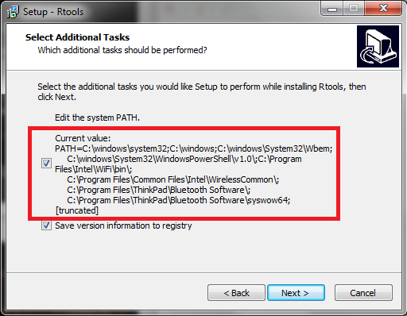

# Prepare your system for package development


Although we'll build a very simple package, we'll use the most modern and powerful tools for R package development. In theory, this could eventually involve compiling C/C++ code, which means you need what's called a *build environment*.

back to [All the package things](packages00_index.html)

### Update R and RStudio

Embarking on your career as an R package developer is an important milestone. Why not celebrate by updating R and RStudio? This is something we recommended early and we recommend doing it often. [Go back to Day 0 of the course](block000_r-rstudio-install.html#r-and-rstudio) for reminders on the process. **DO IT NOW. We are not very interested in solving problems that stem from running outdated versions of R and RStudio.**

*2016-11 FYI: Jenny is running R version 3.3.1 (2016-06-21) Bug in Your Hair and RStudio 1.0.44 at the time of writing.*

### Install `devtools` from CRAN

We use the `devtools` package to help us develop our R package. Do this:

``` r
install.packages("devtools")
library(devtools)
```

### Windows: system prep

You will probably get an immediate warning from `devtools`, complaining that you need `Rtools` in order to build R packages.

You *can ignore* this and successfully develop an R package that consists solely of R code. Such as our toy package.

However, we recommend you install Rtools, so you can take full advantage of `devtools`. Soon, you will want to use `devtools::install_github()` to install R packages from GitHub, instead of CRAN. You will inevitably need to build a package that includes C/C++ code, which *will require* Rtools.

`Rtools` is __NOT an R package__ but is rather "a collection of resources for building packages for R under Microsoft Windows, or for building R itself".

Go here and do what it says:

<http://cran.r-project.org/bin/windows/Rtools/>

During `Rtools` installation you will get to a window asking you to "Select Additional Tasks". **It is important that you make sure to select the box for "Edit the system PATH"**.

*Are we going to recommend making sure Git Bash is NOT on `PATH`? See [#230](https://github.com/STAT545-UBC/Discussion/issues/230#issuecomment-155236031).*



After installing `Rtools`, restart RStudio, then do:

``` r
library(devtools)
find_rtools()
```

Hopefully you will simply see a message saying `TRUE`, indicating that `Rtools` is properly installed. But if there was a problem, you will see a longer message with next steps.

### Mac OS: system prep

You will not get an *immediate* warning from `devtools` that you need to install anything. But before you can build R package with compiled code, you will also need to install more software. Pick one:

  * Minimalist approach (what I do): Install Xcode Command Line Tools.
    - <https://developer.apple.com/downloads/>
    - You will need to sign in with / create a free Apple ID.
    - Download "Command Line Tools OS 10.xxx for Xcode 7.x" appropriate for your OS version.
  * Install the current release of full Xcode from the Mac App Store. WAY more stuff than you need but advantage is App Store convenience.
  * Get older or beta releases of Xcode from <https://developer.apple.com/xcode/download/>.
  
### Linux: system prep

*We've never had this section but [RStudio's `devtools` guide](https://www.rstudio.com/products/rpackages/devtools/) and [R Packages](http://r-pkgs.had.co.nz/intro.html#intro-get) both say the `r-devel` or `r-base-dev` package is required. What gives?*

### Check system prep

`devtools` offers a diagnostic function to check if your system is ready.

``` r
library(devtools)
has_devel()
```

Hopefully you see `TRUE`!

### R packages to help you build yet more R packages

Install more packages. If you already have them, update them.

  * `knitr`
  * `roxygen2`
  * `testthat`

*2016-11 FYI: Jenny is running these versions of this packages at the time of writing.*


```
#>    package *     version       date                              source
#> 1 devtools * 1.12.0.9000 2016-09-26    Github (hadley/devtools@26c507b)
#> 2    knitr *      1.14.2 2016-09-07        Github (yihui/knitr@f02600d)
#> 3 roxygen2 *  5.0.1.9000 2016-10-23 Github (klutometis/roxygen@9ffbad0)
#> 4 testthat *  1.0.2.9000 2016-09-09    Github (hadley/testthat@46d15da)
```

How to check which version of a specific package you've got installed:

``` r
packageVersion("devtools")
```

How to install a package and all it's dependencies:

``` r
install.packages("devtools", dependencies = TRUE)
```

See how profound your problem with out-of-date packages is:

``` r
old.packages()
```

Update one package:

``` r
update.packages("knitr")
```

Just update everything:

``` r
update.packages(ask = FALSE)
```
        
__CAVEAT:__ The above examples will only consult your default library and default CRAN mirror. If you want to target a non-default library, use function arguments to say so. Packages that you have installed from GitHub? You'll need to check the current-ness of your version and perform upgrades yourself.

### Optional: install `devtools` from GitHub

We aren't using bleeding edge features of `devtools`, but you could upgrade to the development version of `devtools` at this point.

Mac and Linux users have it easy. Do this:

``` r
library(devtools)
install_github("hadley/devtools")
```

For Windows instructions, see the [`devtools` README](https://github.com/hadley/devtools).

back to [All the package things](packages00_index.html)
